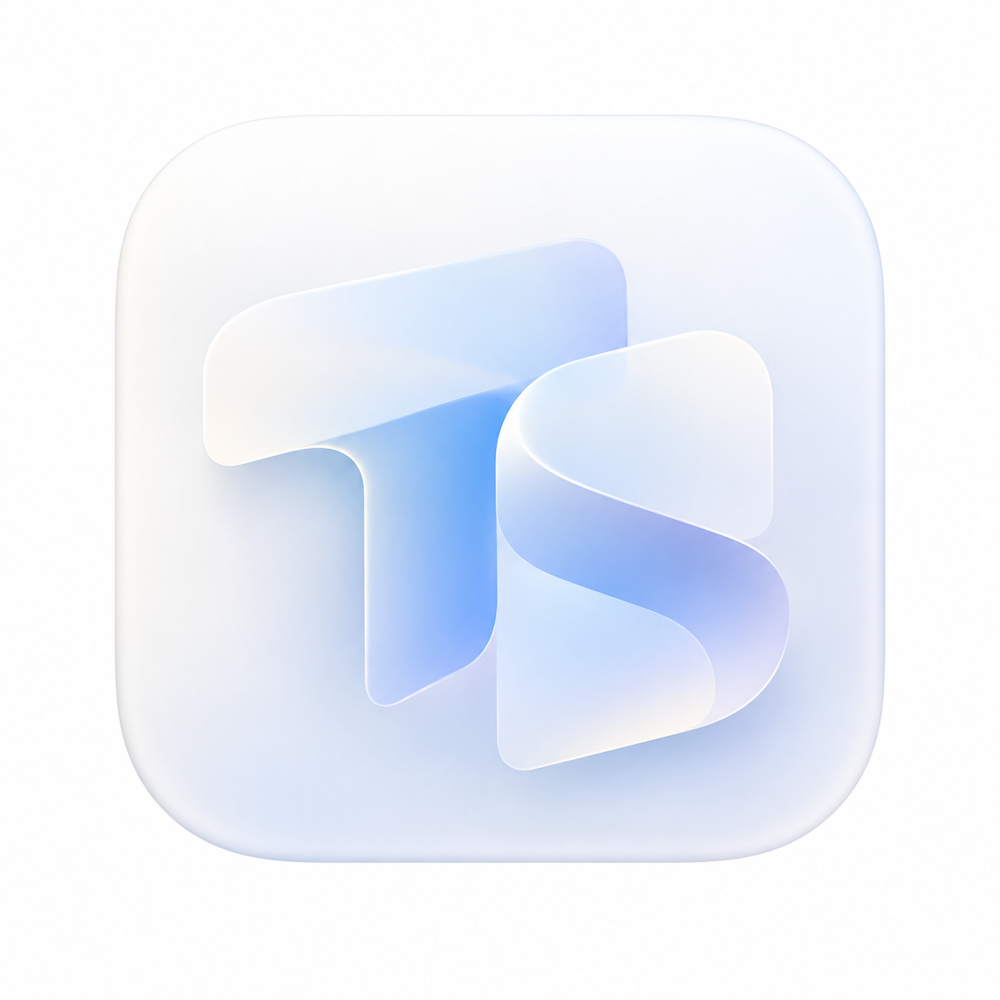

# tran

一个面向 Windows 的桌面翻译工具，支持划词翻译、输入翻译、截图翻译和命名翻译。

[](https://github.com/JouJouoo/tran)
[](https://github.com/JouJouoo/tran)
[](https://tauri.app/)

## 功能

- 划词翻译：选中文本后使用快捷键翻译。
- 输入翻译：打开翻译窗口，输入文本并实时查看结果。
- 截图翻译：框选屏幕区域后进行翻译。
- 命名翻译：一次处理一个文件或文件夹名称，保留文件扩展名。
- 命名格式：`snake_case`、`camelCase`、`PascalCase`、`kebab-case`。
- DeepSeek 独立服务：支持 `deepseek-flash` 和 `deepseek-v4-pro`，支持流式输出和思考模式。
- 支持配置自定义提示词、最大输出长度和 Top P。

## DeepSeek 配置

1. 打开设置中的“翻译服务”。
2. 添加或打开 `DeepSeek` 服务。
3. 填写 DeepSeek API 密钥，选择模型并保存。
4. 需要时可以打开“思考模式”，命名翻译会使用同一套 DeepSeek 配置。

API 地址固定为官方地址：`https://api.deepseek.com/chat/completions`。

## 命名翻译

命名翻译用于把中文名称转换成适合文件夹和文件名的英文名称。

- 默认格式：`snake_case`。
- 支持格式：`snake_case`、`camelCase`、`PascalCase`、`kebab-case`。
- 文件扩展名保持不变，例如 `用户配置.json` 会输出 `user_config.json`。
- 默认快捷键：`Alt+T`，可以在设置中修改。
- 结果默认自动复制，也可以手动点击复制。

## 安装

目前只打包 Windows x64。

### 本地安装包

本地构建后的 NSIS 安装包位于：

```text
src-tauri/target/x86_64-pc-windows-msvc/release/bundle/nsis/tran_1.0.0_x64-setup.exe
```

双击安装包即可安装。

### 从源码运行

```powershell
pnpm install
pnpm tauri dev
```

### 从源码构建

需要安装 Node.js、pnpm、Rust 和 Visual C++ Build Tools，然后运行：

```powershell
pnpm tauri build --target x86_64-pc-windows-msvc
```

构建结果会生成在 `src-tauri/target/x86_64-pc-windows-msvc/release/bundle/`。

## 更新

更新服务连接到 [JouJouoo/tran Releases](https://github.com/JouJouoo/tran/releases)，当前版本从 `1.0.0` 开始。

## 许可证

本项目使用 MIT License，详见 [LICENSE](./LICENSE)。
